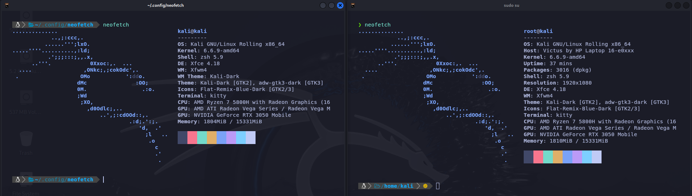

<h1 align="center">Config-Files</h1>

<br>

## ZSHRC
Esta archivo es un fork de arhivo de [s4vitar](https://s4vitar.github.io/bspwm-configuration-files/) con ciertas modificaciones para ajuatarlo a mi gusto personal

```
sudo apt install zsh
```
```
sudo usermod --shell /usr/bin/zsh <nombre usuario>
```
```
rm .zshrc
wget https://raw.githubusercontent.com/bastues/config-files/main/.zshrc
```
```
sudo apt install zsh-syntax-highlighting zsh-autosuggestions
```
```
cd /usr/share
sudo mkdir zsh-sudo
sudo chown usuario:grupo zsh-sudo
cd zsh-sudo
sudo wget https://raw.githubusercontent.com/ohmyzsh/ohmyzsh/master/plugins/sudo/sudo.plugin.zsh
```
<br>

## KITTY
Estos archivo es un fork del archivos de [rxyhn](https://github.com/rxyhn/tokyo/tree/main/config/kitty
) con ciertas modificaciones para ajuatarlo a mi gusto personal 
```
sudo apt install kitty
```
```
sudo update-alternatives --config x-terminal-emulator
```
```
cd .config/kitty
wget https://raw.githubusercontent.com/bastues/config-files/main/kitty/color.ini
wget https://raw.githubusercontent.com/bastues/config-files/main/kitty/kitty.conf
```
```
Default Aplications > Utilities > kitty
```
<br>

## POWERSHELL 10K
Estos archivos son un fork del los archivos de configuracion de que se muestran en el video del creador *s4vitar* (enlace en la descripcion) con ciertas modificaciones para ajuatarlo a mi gusto personal
https://www.youtube.com/watch?v=fshLf6u8B-w&t=3581s (minuto: 1:17:57)
```
git clone --depth=1 https://github.com/romkatv/powerlevel10k.git ~/powerlevel10k
echo 'source ~/powerlevel10k/powerlevel10k.zsh-theme' >>~/.zshrc
```
```
rm .p10k.zsh
wget https://raw.githubusercontent.com/bastues/config-files/main/p10k/user/.p10k.zsh
```
> [!CAUTION]
> Agregacion de zsh y powershell en root, asegurate de modificar en el enlace simbolico con tu usuario local
```
usermod –shell /usr/bin/zsh root
ln -s -f /home/usuario/.zshrc /root/.zshrc
git clone --depth=1 https://github.com/romkatv/powerlevel10k.git ~/powerlevel10k
echo 'source ~/powerlevel10k/powerlevel10k.zsh-theme' >>~/.zshrc
cd
rm .p10k.zsh
wget https://raw.githubusercontent.com/bastues/config-files/main/p10k/root/.p10k.zsh
```
<br>

## GPG
Configuracion del gpg para que la cache no alamacene la contraseña en cache
```
cd .gnupg
nano gpg-agent.conf
wget https://raw.githubusercontent.com/bastues/config-files/main/gpg-agent.conf
gpgconf --kill gpg-agent
gpgconf --launch gpg-agent
```
<br>

## Fuente
Instalar fuentes customizadas de [nerd fonts](https://www.nerdfonts.com/font-downloads)
```diff
cd /usr/share/fonts
wget https://www.nerdfonts.com/font-downloads
-unzip "fuente.zip"
```


